# 🎓 CampusHub

A College Management System developed using **PHP, MySQL, Bootstrap, HTML, CSS, and JavaScript**.

---

## 📌 Features

### 👨‍💼 Admin Features

- Secure Admin Login
- Dashboard with Student, Faculty, and Admin Statistics
- Add, Edit, Delete, and Search Students
- Add, Edit, Delete, and Search Faculty
- Create and Delete Notices
- View Sliding Notice Board
- Manage the entire CampusHub system
- Secure Logout

---

### 👨‍🏫 Faculty Features

- Secure Faculty Login
- Faculty Dashboard
- View Student Details
- Update Student CGPA
- Update Student Attendance Percentage
- View Latest Notices
- Secure Logout

---

### 👨‍🎓 Student Features

- Secure Student Login
- Student Dashboard
- View Personal Profile
- View CGPA
- View Attendance Percentage
- View Latest Notices
- Secure Logout

---

## 🛠️ Technologies Used

- PHP
- MySQL
- HTML5
- CSS3
- Bootstrap 5
- JavaScript
- XAMPP

---

## 📂 Project Structure

```text
CampusHub/
│── admin/
│── assets/
│── config/
│── database/
│── includes/
│── login.php
│── students.php
│── faculty.php
│── student_dashboard.php
│── faculty_dashboard.php
│── notice.php
│── README.md
```

---
# 📸 Screenshots

## Login Page

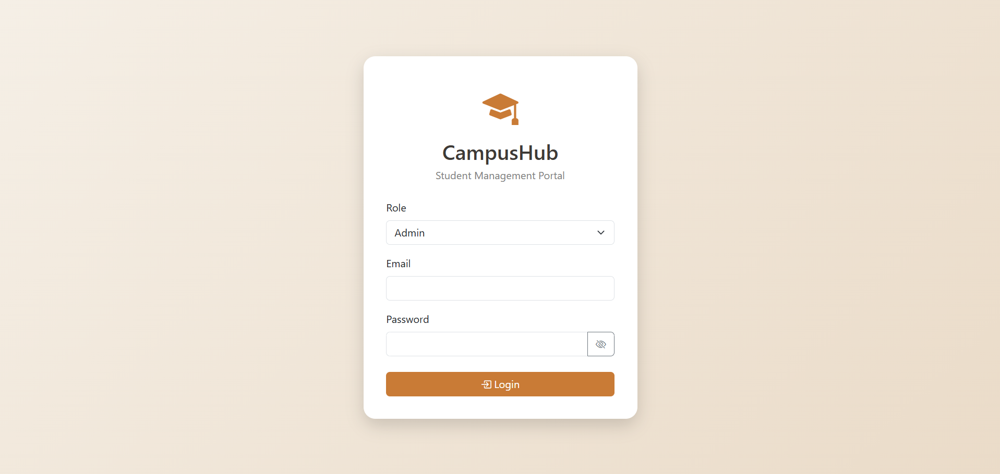
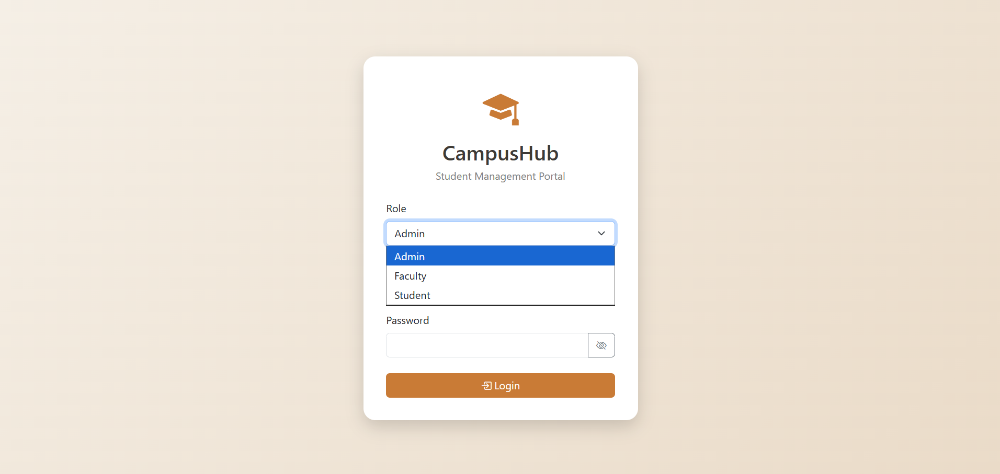

---

## Admin Dashboard

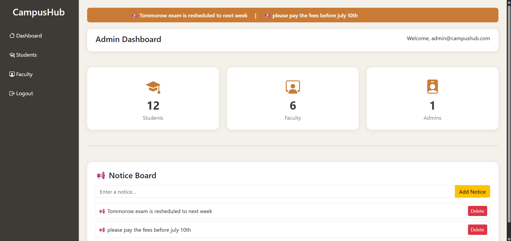
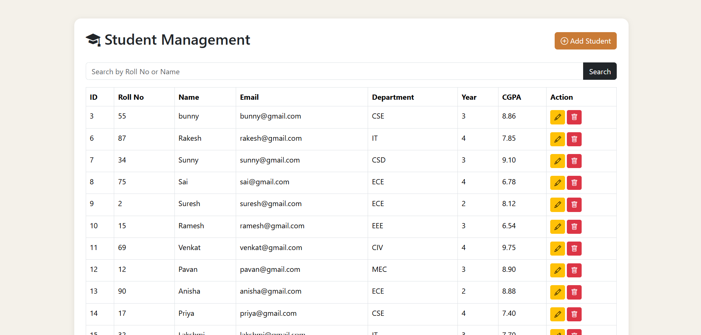
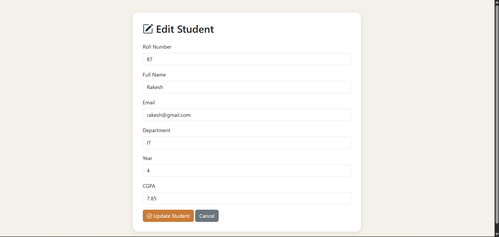
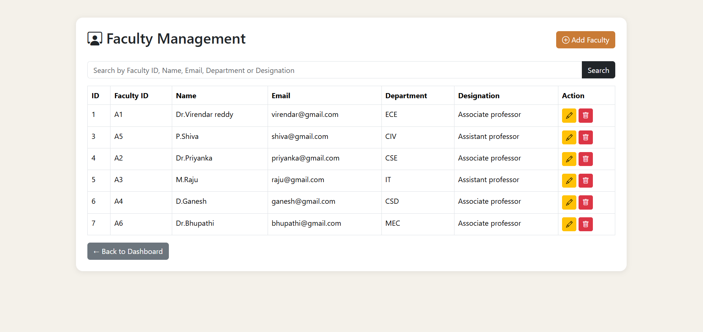
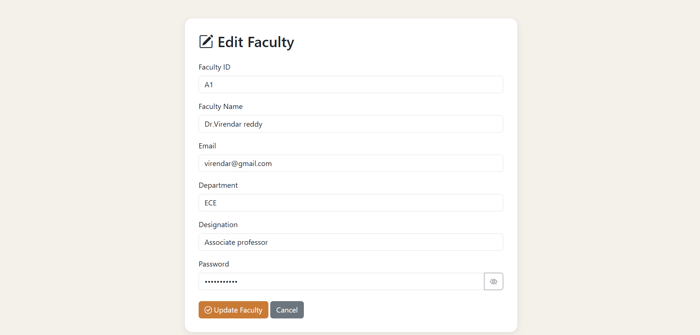

---

## Faculty Dashboard

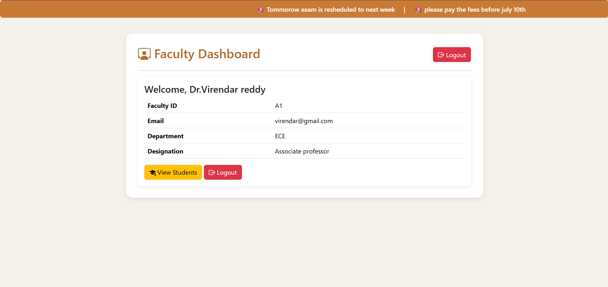
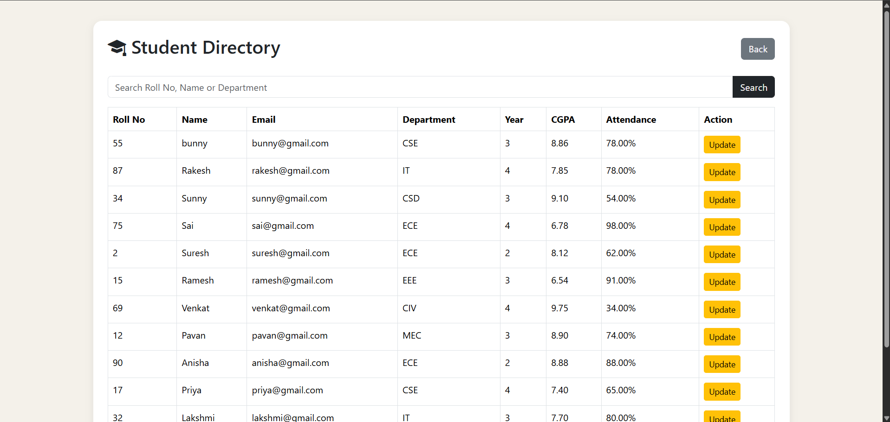
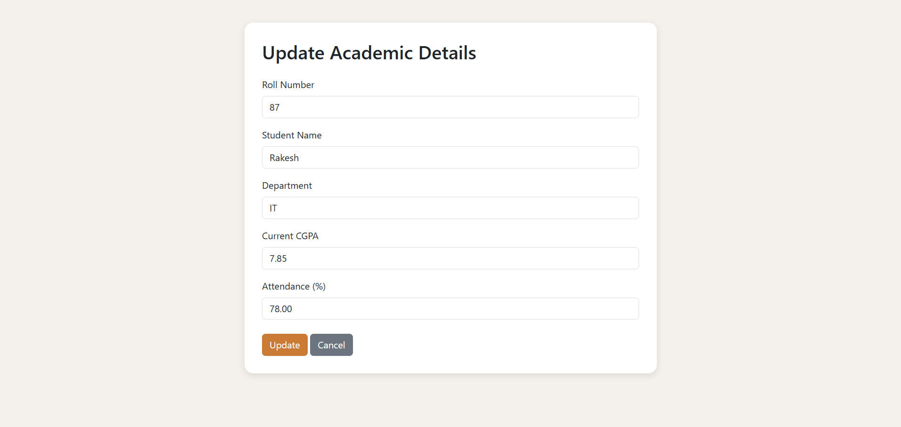

---

## Student Dashboard

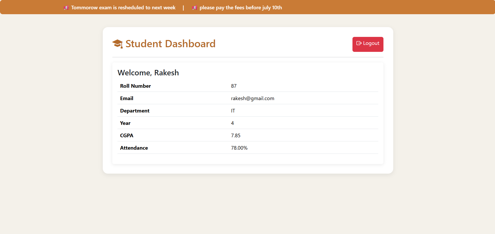

## 🚀 Installation

1. Install XAMPP.
2. Copy the project into the `htdocs` folder.
3. Start Apache and MySQL.
4. Import `database/campushub.sql`.
5. Configure `config/db.php`.
6. Open:

http://localhost/CampusHub

---
## ⚙️ Database Configuration

1. Open the `config` folder.
2. Copy `db.example.php`.
3. Rename the copied file to `db.php`.
4. Update the database credentials according to your MySQL setup.

Example:

```php
$host = "localhost";
$user = "root";
$password = "";
$database = "campushub";
```
---

## 🔑 Default Admin Login

After importing the database, use the following credentials:

**Email**

```text
admin@campushub.com
```

**Password**

```text
admin123
```

> You can change these credentials later from the database if required.
---

## 📌 Important Note

- Import the `database/campushub.sql` file into MySQL.
- Create `config/db.php` using `config/db.example.php`.
- Update the database credentials in `db.php`.
- Start Apache and MySQL using XAMPP.
- Open `http://localhost/CampusHub` in your browser.

---

## 👥 Demo Credentials

### 👨‍💼 Admin

Email: `admin@campushub.com`
Password: `admin123`

---

### 👨‍🏫 Faculty

Email: `virendar@gmail.com`
Password: `virendar123`

---

### 👨‍🎓 Student

Email: `rakesh@gmail.com`
Password: `rakesh123`

---

## 👨‍💻 Developed By

23881A04H3 - Mustigolla Rishith Yadav
23881A04G4 - Konda Shashi Kumar
23881A04D5 - Banoth Akhil Nayak

B.Tech in Electronics and Communication Engineering,
Vardhaman College of Engineering.

---

📜 License

This project is developed for educational purposes.